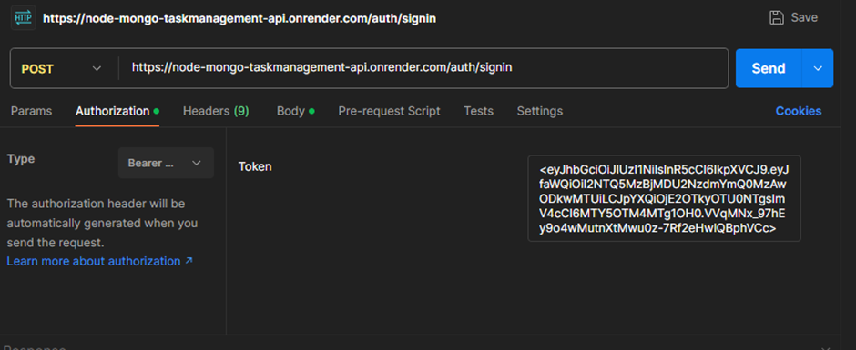

# Task Management API Documentation

## Introduction

Welcome to the Task Management API documentation. This API allows you to manage tasks and
user accounts in a task management application.

## Base URL

The base URL for all API endpoints is: https://node-mongo-taskmanagement-api.onrender.com/

## Authentication

To access most of the API endpoints, you need to be authenticated. Authentication is done using
JWT (JSON Web Tokens). You must include your token in the Authorization header as follows:

## User Endpoints

**User Registration:**

POST /auth/signup

Description: Create a new user account.

Request Body:

Response:

201 Created: User registration successful

400 Bad Request: Invalid input or duplicate registration

500 Internal Server Error: Server error

**User Login**

POST /auth/signin

Description: Authenticate a user and obtain a JWT token.

Request Body:

Response:

200 OK: Login successful (returns JWT token)

401 Unauthorized: Invalid credentials

500 Internal Server Error: Server error

## Task Endpoints

**Create a Task**

POST /task/add

Description: Create a new task.

Request Body:

Response:

201 Created: Task created successfully

401 Unauthorized: Authentication required

400 Bad Request: Invalid input

500 Internal Server Error: Server error

**Update a Task**

PUT /task/{task_id}

Description: Update an existing task.

Request Body:

{

"id": "user_id",

"string": "task_status"

}

Response:

200 OK: Task updated successfully

401 Unauthorized: Authentication required

403 Forbidden: Access denied

404 Not Found: Task not found

400 Bad Request: Invalid input

500 Internal Server Error: Server error

**List Tasks**

GET /task/tasks

Description: Retrieve a list of tasks.

Request Body:

{

"id": "user_id",

}

Response:

200 OK: List of tasks

500 Internal Server Error: Server error

**Delete a Task**

DELETE / task/{task_id}

Description: Delete a specific task.

Request Body:

{

"id": "user_id",

}

Response:

204 No Content: Task deleted successfully

401 Unauthorized: Authentication required

403 Forbidden: Access denied

404 Not Found: Task not found

500 Internal Server Error: Server error

Error Codes

The API may return the following error codes:

400 Bad Request: Invalid input data or duplicate registration.

401 Unauthorized: Authentication required or invalid credentials.

403 Forbidden: Access denied.

404 Not Found: Resource not found.

500 Internal Server Error: Server error.

## Conclusion

This documentation provides information on how to interact with the Task Management API. If you
have any questions or encounter issues, please free to contact. We appreciate your feedback and
suggestions for improvement.

